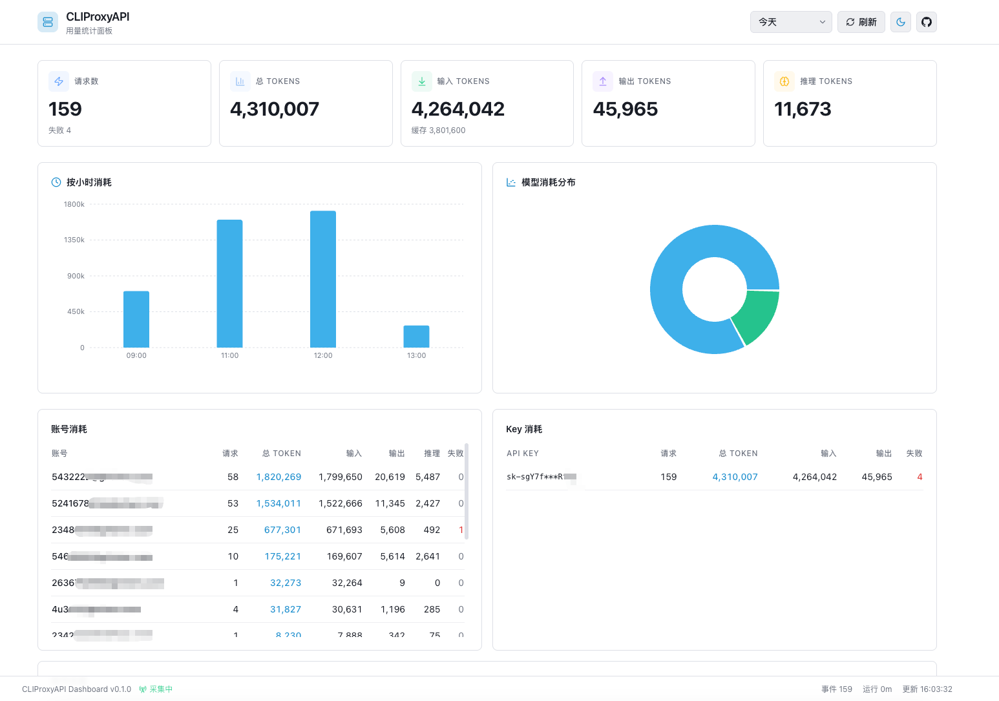
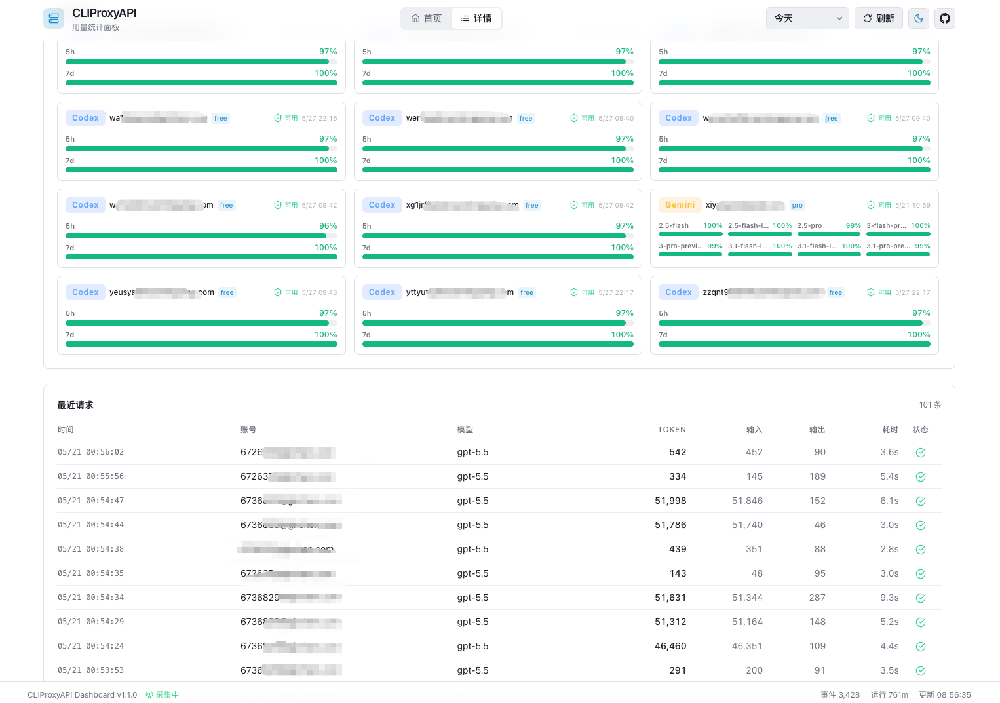

# CLIProxyAPI Dashboard

CLIProxyAPI 用量统计与监控面板。本项目完全通过 DeepSeek TUI + DeepSeek-V4-Pro 开发。通过 CLIProxyAPI Management API 实时采集每次请求的用量数据，存储到本地 SQLite，并提供可视化仪表盘。

## 功能

- **KPI 总览** — 请求数、总 Token、输入/输出/推理 Token、缓存 Token
- **时间趋势** — 按小时的 Token 消耗面积图
- **模型分布** — 各模型 Token 消耗环形饼图，Top 7 独立展示，其余归入"其他"
- **账号消耗** — 按账号/来源分组的详细统计表
- **Key 消耗** — 按 API Key 分组的 Token 消耗明细
- **账号余量** — Codex 5h/7d 配额剩余百分比进度条（Kimi\Claude\Gemini功能不完善）
- **请求明细** — 最近每次请求的 Token、耗时、模型信息
- **时间范围** — 支持今天、1h、5h、24h、7d 五种视图切换
- **亮色/暗色模式** — 一键切换，偏好自动持久化到 localStorage
- **登录认证** — 可选访问密钥保护，输入正确密钥后才能查看数据
- **实时刷新** — 每 10 秒自动拉取最新数据，手动刷新按钮
- **采集状态** — Footer 显示采集器运行状态、事件数、运行时长

## 截图





## 快速开始

### 前置条件

- Node.js 18+
- CLIProxyAPI 已启动并启用 Management API
- CLIProxyAPI 用量统计已开启

在 CLIProxyAPI 配置中确保：

```yaml
usage-statistics-enabled: true
redis-usage-queue-retention-seconds: 3600
```

### 本地运行

```bash
# 1. 进入项目目录
cd cliproxyapi-dashboard

# 2. 安装依赖
npm install

# 3. 配置环境变量
cp .env.example .env
# 编辑 .env，填入 MANAGEMENT_KEY

# 4. 启动开发服务器
npm run dev
```

浏览器访问 `http://localhost:3000`

### Docker 部署

```bash
# 1. 配置环境变量
cp .env.example .env
# 编辑 .env

# 2. 启动
docker-compose up -d

# 3. 查看日志
docker-compose logs -f
```

```bash
# docker run
docker run -d \
  --name cliproxyapi-dashboard \
  --restart unless-stopped \
  -p 3000:3000 \
  -e CLIPROXY_URL="${CLIPROXY_URL:-http://127.0.0.1:8317}" \
  -e MANAGEMENT_KEY="${MANAGEMENT_KEY:-}" \
  -e ACCESS_KEY="${ACCESS_KEY:-admin123}" \
  -e POLL_INTERVAL_SECONDS="${POLL_INTERVAL_SECONDS:-2}" \
  -e QUOTA_REFRESH_SECONDS="${QUOTA_REFRESH_SECONDS:-300}" \
  -e SOCKS5_PROXY_HOST="${SOCKS5_PROXY_HOST:-}" \
  -e SOCKS5_PROXY_PORT="${SOCKS5_PROXY_PORT:-0}" \
  -e SOCKS5_PROXY_USERNAME="${SOCKS5_PROXY_USERNAME:-}" \
  -e SOCKS5_PROXY_PASSWORD="${SOCKS5_PROXY_PASSWORD:-}" \
  -v "$(pwd)/data:/app/data" \
  -v "$(pwd)/auths:/app/auths:ro" \
  xiyangai/cliproxyapi-dashboard:latest
  
```

浏览器访问 `http://localhost:3000`

## 环境变量

| 变量 | 默认值 | 说明 |
|------|--------|------|
| `CLIPROXY_URL` | `http://127.0.0.1:8317` | CLIProxyAPI 完整地址（推荐，支持 `https://` 和域名） |
| `CLIPROXY_HOST` | `127.0.0.1` | CLIProxyAPI 地址（仅 `CLIPROXY_URL` 未设置时生效） |
| `CLIPROXY_PORT` | `8317` | 端口（仅 `CLIPROXY_URL` 未设置时生效） |
| `MANAGEMENT_KEY` | (必填) | Management API 明文密钥 |
| `ACCESS_KEY` | — | Dashboard 登录密钥（不设置则跳过认证） |
| `POLL_INTERVAL_SECONDS` | `2` | 采集间隔（秒） |
| `QUOTA_REFRESH_SECONDS` | `300` | 余量刷新间隔（秒） |
| `DB_PATH` | `./data/usage.sqlite` | SQLite 数据库路径 |
| `AUTH_DIR` | — | Codex OAuth 文件目录（可选，用于余量查询） |
| `SOCKS5_PROXY_HOST` | — | 余量查询代理地址 |
| `SOCKS5_PROXY_PORT` | `0` | 余量查询代理端口（0 = 禁用） |
| `SOCKS5_PROXY_USERNAME` | — | 代理用户名（可选，与密码同时配置） |
| `SOCKS5_PROXY_PASSWORD` | — | 代理密码（可选，与用户名同时配置） |

> **推荐使用 `CLIPROXY_URL`**：填写 `http://127.0.0.1:8317`，系统自动解析协议、主机和端口。旧版 `CLIPROXY_HOST` + `CLIPROXY_PORT` 仍兼容。

## 登录认证

设置 `ACCESS_KEY` 环境变量后，访问 Dashboard 时需先输入密钥。认证通过后浏览器会存储 httpOnly Cookie，30 天内无需重复登录。不设置 `ACCESS_KEY` 则跳过认证，直接进入面板。

```bash
# .env
ACCESS_KEY=your-secret-key
```

## 数据存储

所有用量数据保存在本地 SQLite 数据库中（WAL 模式），不上传到任何第三方服务。数据库包含两张表：

- `usage_events` — 每次 API 请求的用量事件（Token 数、模型、账号、API Key Hash、耗时等）
- `quota_snapshots` — ChatGPT/Codex 账号的配额快照（可选）

## 架构

```
CLIProxyAPI :8317  ←→  Dashboard (Next.js)
  │                        │
  │ GET /usage-queue       │ 采集器 (每 N 秒轮询)
  │                        │
  │                        ↓
  │                    SQLite
  │                        │
  │                        ↓
  │                 API Routes (+ Auth 中间件)
  │                        │
  │                        ↓
  └────────────────→  React 面板 (亮/暗主题)
```

## API 端点

| 端点 | 认证 | 说明 |
|------|------|------|
| `GET /api/health` | 需认证 | 健康检查、采集状态 |
| `GET /api/summary?range=today` | 需认证 | 用量汇总（含按账号/模型/Key/小时分组） |
| `GET /api/requests?limit=100` | 需认证 | 最近请求明细 |
| `GET /api/quota` | 需认证 | 账号余量快照 |
| `POST /api/auth` | 无需认证 | 登录验证 |
| `GET /api/auth` | 无需认证 | 检查登录状态 |

## 技术栈

- **框架**: Next.js 14 (App Router)
- **图表**: Recharts (面积图 / 环形饼图)
- **数据库**: better-sqlite3 (WAL 模式)
- **样式**: Tailwind CSS + CSS 变量主题系统
- **图标**: Lucide React
- **认证**: httpOnly Cookie + Edge Middleware

## 许可证

MIT
