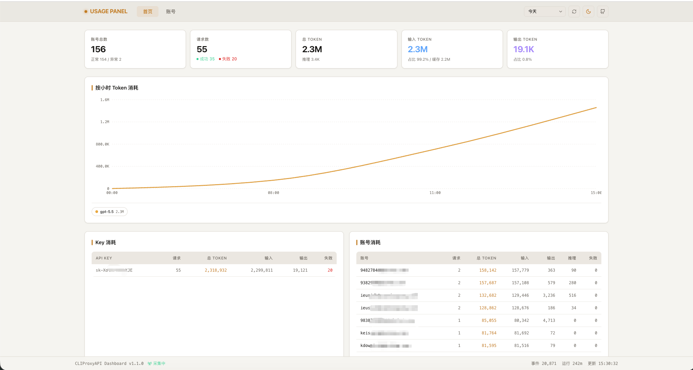
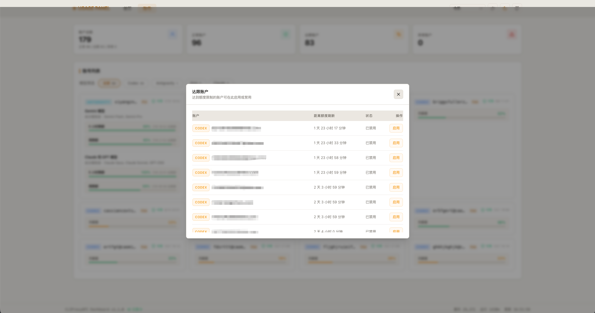

# CLIProxyAPI Dashboard

[](https://nextjs.org/)
[](https://www.sqlite.org/)
[](https://www.docker.com/)
[](#许可证)

[简体中文](README.md) | [English](README_EN.md)

**CLIProxyAPI Dashboard** 是一个本地优先的 CLIProxyAPI 用量与账号余量面板。它轮询 CLIProxyAPI Management API，将请求用量写入本地 SQLite，并集中展示账号、API Key、模型与 Provider 额度状态。

**重要：** 当前项目只测试了Antigravity以及Codex的免费账户，其他的没有账户进行测试。

> 所有业务数据保存在本地 SQLite。账号余量功能会按需访问对应 Provider 的接口；请妥善保管认证文件和环境变量。

## 截图





## 功能

- **用量总览**：请求数、成功/失败、输入/输出/推理/缓存 Token，以及按时间范围的趋势图。
- **消耗分析**：按模型、账号和脱敏 API Key 聚合 Token 与失败请求；最近请求支持查看耗时和状态。
- **账号余量**：读取 `AUTH_DIR` 内的 JSON 认证文件，展示 Codex、Antigravity、Kimi、Claude 的可用状态、余量、套餐和重置时间；账号页支持按 Provider 筛选，并统计账户总数与认证失败数。
- **额度管理**：Codex 账号达到主额度阈值后会标记为禁用，并在额度重置后定期尝试恢复；异常认证文件可在页面中删除。
- **双页签布局**：「首页」聚焦用量趋势与消耗分析，「账号」页集中管理认证文件与额度状态。
- **本地优先**：用量事件和额度快照存储在 SQLite（WAL 模式），数据目录可直接挂载到宿主机。
- **访问保护**：设置 `ACCESS_KEY` 后，面板与 API 通过 httpOnly Cookie 登录保护。
- **可观测性**：自动采集、手动刷新、亮/暗色主题，以及页脚采集器状态。

## 快速开始

### 前置条件

- Node.js 18+（Docker 镜像使用 Node.js 20）
- 已运行的 CLIProxyAPI，且 Dashboard 能访问其 Management API
- 已开启 CLIProxyAPI 用量统计

CLIProxyAPI 配置至少需要启用：

```yaml
usage-statistics-enabled: true
redis-usage-queue-retention-seconds: 3600
```

### 本地开发

```bash
# 1. 克隆并进入项目
cd cliproxyapi-dashboard

# 2. 安装锁定版本的依赖
npm ci

# 3. 配置运行环境
cp .env.example .env
# 编辑 .env，至少设置 MANAGEMENT_KEY

# 4. 启动开发服务器
npm run dev
```

访问 `http://localhost:3000`。

### Docker Compose 部署

```bash
cp .env.example .env
# 编辑 .env，至少设置 MANAGEMENT_KEY 与可访问的 CLIPROXY_URL

docker compose up -d --build
docker compose logs -f
```

默认服务会将 SQLite 挂载到 `./data`，并将宿主机 `./auths` 以只读方式挂载到容器 `/app/auths`。

> **Docker 网络提示：** 在 bridge 网络中，`CLIPROXY_URL=http://127.0.0.1:8317` 指向 Dashboard 容器自身，而不是宿主机上的 CLIProxyAPI。请将它改为 Dashboard 容器可访问的 LAN 地址、域名，或同一 Docker 网络中的服务名。

### 使用预构建镜像

```bash
cp .env.example .env
# 编辑 .env

docker run -d \
  --name cliproxyapi-dashboard \
  --restart unless-stopped \
  --env-file .env \
  -p 3000:3000 \
  -v "$(pwd)/data:/app/data" \
  -v "$(pwd)/auths:/app/auths:ro" \
  xiyangai/cliproxyapi-dashboard:latest
```

## 配置

`CLIPROXY_URL` 优先级最高；未设置时才使用 `CLIPROXY_HOST`、`CLIPROXY_PORT` 和 `CLIPROXY_HTTPS` 组合地址。

| 变量 | 应用默认值 | 说明 |
| --- | --- | --- |
| `CLIPROXY_URL` | — | CLIProxyAPI 地址，如 `http://192.168.1.10:8317`。路径、查询参数会被忽略。 |
| `CLIPROXY_HOST` | `127.0.0.1` | 兼容旧配置；仅在未设置 `CLIPROXY_URL` 时使用。 |
| `CLIPROXY_PORT` | `8317` | 兼容旧配置；仅在未设置 `CLIPROXY_URL` 时使用。 |
| `CLIPROXY_HTTPS` | `false` | 旧配置模式下设为 `true` 时使用 HTTPS。 |
| `MANAGEMENT_KEY` | — | **必填**。CLIProxyAPI Management API 密钥。 |
| `DB_PATH` | `./data/usage.sqlite` | SQLite 数据库位置。Docker 默认将 `./data` 挂载到 `/app/data`。 |
| `AUTH_DIR` | 未设置 | Provider 认证 JSON 文件目录；不设置则不采集账号余量。 |
| `POLL_INTERVAL_SECONDS` | `2` | CLIProxyAPI 用量队列轮询间隔（秒）。 |
| `QUOTA_REFRESH_SECONDS` | `300` | 账号余量刷新间隔（秒）。小于 60 或无效时会回退到 300 秒。 |
| `SOCKS5_PROXY_HOST` | — | 账号余量请求使用的 SOCKS5 代理主机。 |
| `SOCKS5_PROXY_PORT` | `0` | SOCKS5 代理端口；`0` 表示不使用代理。 |
| `SOCKS5_PROXY_USERNAME` | — | SOCKS5 用户名；设置后必须同时设置密码。 |
| `SOCKS5_PROXY_PASSWORD` | — | SOCKS5 密码；设置后必须同时设置用户名。 |
| `ACCESS_KEY` | — | 面板登录密钥；留空时不启用认证。当前 `docker-compose.yml` 在未提供该变量时默认使用 `admin123`，生产环境请改成随机长密码。 |

## 账号余量与认证文件

设置 `AUTH_DIR` 后，应用会在启动时立即读取目录**第一层**的 `*.json` 文件，并按 `QUOTA_REFRESH_SECONDS` 定时刷新。认证文件至少需要邮箱、访问令牌或 API Key 中的一项，并通过 `type`（或文件名前缀）识别 Provider。

```text
auths/
├── codex-work.json
├── antigravity-main.json
├── kimi.json
└── claude.json
```

最小结构示例：

```json
// Codex：access_token 必填；account_id、user_agent 可选
{
  "type": "codex",
  "email": "user@example.com",
  "access_token": "<redacted>",
  "account_id": "<optional>"
}
```

```json
// Antigravity：使用客户端生成的 OAuth 信息
{
  "type": "antigravity",
  "email": "user@example.com",
  "access_token": "<redacted>",
  "refresh_token": "<redacted>",
  "project_id": "<optional>"
}
```

```json
// Kimi / Claude：api_key 必填
{
  "type": "kimi",
  "email": "user@example.com",
  "api_key": "<redacted>"
}
```

```json
{
  "type": "claude",
  "email": "user@example.com",
  "api_key": "<redacted>"
}
```

- Codex 使用账号的额度窗口；Kimi 读取余额；Claude 检查 Key 可用性；Antigravity 展示返回的额度组与刷新时间。
- 认证失败、权限不足和请求频率限制会记录到账号页；删除异常账号会调用 CLIProxyAPI Management API 删除对应认证文件，并在当前进程中隐藏该条目。
- `disabled: true` 可手动跳过账号。Codex 达到主额度阈值时也会自动标记禁用，并每 10 分钟检查是否可恢复。

> **安全提示：** `auths/*.json` 可包含 access token、refresh token 或 API Key。不要提交、共享、记录到日志，或复制进 Docker 镜像；生产部署请限制该目录权限。

## 数据与接口

SQLite 使用 WAL 模式保存两类数据：

- `usage_events`：请求事件、Token、模型、账号、脱敏 API Key、耗时和状态。
- `quota_snapshots`：Provider 账号余量快照、套餐、重置时间和原始响应。

设置 `ACCESS_KEY` 后，除 `/login` 和 `/api/auth` 外，页面和 API 都需要登录。主要 API：

| Endpoint | 说明 |
| --- | --- |
| `GET /api/health` | 健康检查和采集器状态。 |
| `GET /api/summary?range=today` | 按账号、模型、Key 与时间聚合的用量摘要。 |
| `GET /api/requests?limit=100&range=today` | 最近请求明细。 |
| `GET /api/quota` | 账号余量快照、异常账号与受限账号。 |
| `DELETE /api/quota/auth-file` | 删除异常账号对应的认证文件。 |
| `POST /api/auth` | 提交 Dashboard 登录密钥。 |
| `GET /api/auth` | 查询登录状态。 |

## 技术栈

- Next.js 14（App Router） + React 18
- SQLite / `better-sqlite3`
- Tailwind CSS、Recharts、Framer Motion、Lucide React
- Docker 多阶段构建

## 许可证

MIT
